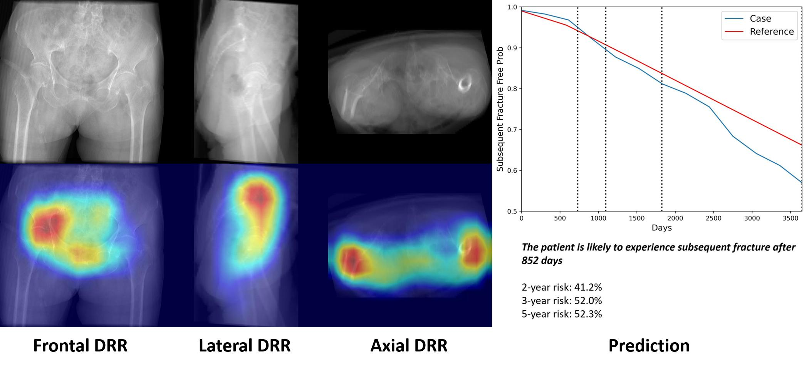

A CT-based Deep Learning Model for Predicting Subsequent Fracture Risk in Patients with Hip Fracture (Under review)
--

The repository is currently empty. All codes will be uploaded after publication.

- contact: yisakk@snu.ac.kr
